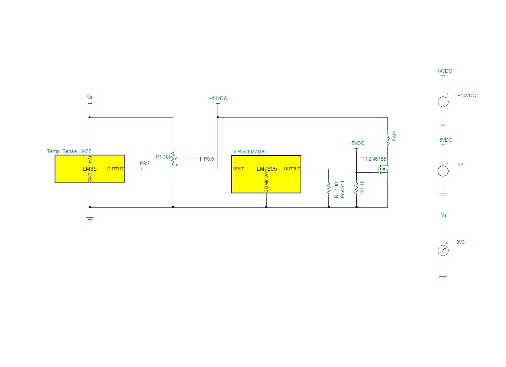

# Closed Loop Temperature Control System for MSP430FR6989

This repo contains the source code and application note by Damon Boorstein, Stephen Glass, and Brendan Nugent. The source code can be found in the sub-folder marked [code](code). The application note can be viewed on Google Docs [here](https://docs.google.com/a/students.rowan.edu/document/d/1tl_ZTwqizf479Djhk0YucLbRZvN3xw_1O4nQaTA-0f4/edit?usp=sharing).

## Dependencies

This code requires two header files: one for the MSP430FR6989

```c
#include <msp430fr6989.h>
```

and one for the LCD Driver.

```c
#include "LCDDriver.h"
```

## Usage

These source files are intended to be debugged in a Code Composer Studio project. Create a new project in Code Composer Studio with FR6989 as the target configuration. Include the three files in the source code folder. Then, simply build and debug to an MSP430FR6989 device.

## Function

Check the [app. note](https://docs.google.com/a/students.rowan.edu/document/d/1tl_ZTwqizf479Djhk0YucLbRZvN3xw_1O4nQaTA-0f4/edit?usp=sharing) for a more detailed explanation on the code. 

This code:
* generates a hardware PWM output on its Timer A output pin
* performs analog-to-digital conversion of temperature input
* performs analog-to-digital conversion of potentiometer position (voltage division)
* calculates a duty cycle for PWM based on desired temperature (potentiometer) and current temperature (temperature sensor)

## Testing this Code on a Circuit

More elaboration on this code and the hardware side of this milestone can be found in the [app. note](https://docs.google.com/a/students.rowan.edu/document/d/1tl_ZTwqizf479Djhk0YucLbRZvN3xw_1O4nQaTA-0f4/edit?usp=sharing).

To test this code on a breadboard, build the following circuit:



Connect the FR6989 Timer A PWM output to the port labeled "Vs". Connect "P8.6" and "P8.7" to their respective pins on the microcontroller. Supply the voltage rails with +5V, and +14V as shown. Ensure common grounds when testing.

